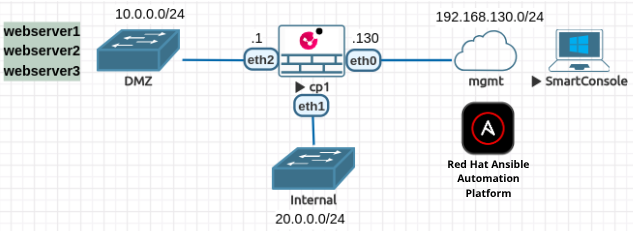
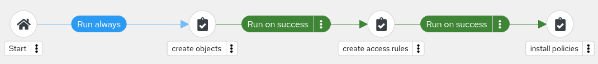

# Check Point automation with Ansible

This project demonstrates an example of automating Check Point configuration using the Ansible Automation Platform. A standalone deployment is used meaning both the Security Gateway and Security Management Server components are installed on the same virtual machine. The following topology is utilized:

Below Job Workflow is used to automate the configuration of Check Point objects (networks, hosts, and groups), security policies and the automatic installation of the policy. It enables http/https traffic from Internal_Network to Web_Servers group in DMZ and from Mgmt_Network to cp1 node:

As we can see the modular approach is used here and separate Job Templates are used per particular functionality automation. It is implemented by using Ansible Tags in Roles and on Job Templates level. This hierarchy is also reflected in variables definition in group_vars folder (separate variables file per functionality).  
  
## Author

[@mzdyb](https://www.linkedin.com/in/michal-zdyb-9aa4046/)
